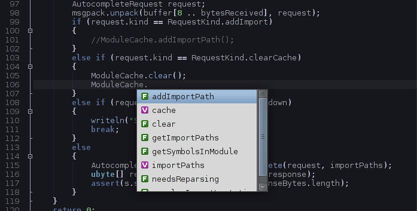

# DCD 
The D Completion Daemon is an auto-complete program for the D programming language.

(The above is a screenshot of [Textadept](http://foicica.com/textadept/))

DCD is not an IDE. DCD is designed to provide autocompletion for your favorite
text editor. If you are looking for an IDE, try [one of these](http://wiki.dlang.org/IDEs).

DCD consists of a client and a server. The client (dcd-client) is almost always
used through a text editor script or plugin, though it can be used from the
command line. The server (dcd-server) is responsible for caching imported files,
calculating autocomplete information, and sending it back to the client.

# Status

This program is reasonably stable. Please report problems on the Github issue
tracker. Please be sure that you have read the documentation before filing an
issue. (If you want to help your bug to get fixed faster, you can create a
[test case](https://github.com/dlang-community/DCD/wiki/Testing) that helps isolate
the issue.)

* Working:
	* Autocompletion of properties of built-in types such as int, float, double, etc.
	* Autocompletion of __traits, scope, and extern arguments
	* Autocompletion of enums
	* Autocompletion of class, struct, and interface instances.
	* Display of call tips for functions, constructors, and variables of function type
	* alias declarations
	* Public imports
	* Finding the declaration location of a symbol at the cursor
	* *import* statement completions
	* Display of documentation comments in function call tips
	* *alias this*
	* *auto* declarations (Mostly)
	* *with* statements
	* Simple UFCS suggestions for concrete types and fundamental types.
* Not working:
	* UFCS completion for templates, literals, aliased types, UFCS function arguments, and '.' chaining with other UFCS functions.
	* UFCS calltips
	* Autocompletion of declarations with template arguments (This will work to some extent, but it won't do things like replace T with int)
	* Determining the type of an enum member when no base type is specified, but the first member has an initializer
	* auto functions (which can then propagate the failure to auto declarations)
	* That one feature that you *REALLY* needed.

# Setup
### General

1. Install a recent D compiler. DCD is tested with DMD 2.068.2, DMD 2.069.0-rc2, and LDC 0.16 (Do not use DMD 2.068.1)
1. Follow the directions listed below for Homebrew, Git + Make, or Dub, depending on how you would like to build DCD.
1. Configure your text editor to call the dcd-client program. See the [wiki](https://github.com/dlang-community/DCD/wiki/IDEs-and-Editors-with-DCD-support) for information on configuring your specific editor.
1. Start the dcd-server program before editing code. (Unless, of course, your editor's plugin handles this for you)

### Git + Make

1. Install a recent D compiler.
1. Run `git submodule update --init --recursive` after cloning this repository to grab the various dependencies.
1. Optionally set the environment variable `DC` if you wish to use another compiler than the DMD known by the system.
1. Run `make` to build the client and server. (Or run build.bat on Windows).

### OS X w/ Homebrew

1. `brew install dcd`

### Dub

1. `dub build --build=release --config=client`
1. `dub build --build=release --config=server`

# Sockets
## TCP

On Windows DCD will use TCP sockets to communicate between the client and server.
DCD can use TCP sockets on other operating systems if the client and server use
the `--tcp` or `--port` command-line switches.

## UNIX domain sockets

Operating systems that support UNIX domain sockets will use them by default.
The path to the socket file can be overriden with the `--socketFile` option.
These are the default paths:

#### OSX

The socket will be created at `/var/tmp/dcd-${UID}.socket`

#### Linux/BSD

The client and server will attempt to create the socket in the following locations:
* `${XDG_RUNTIME_DIR}/dcd.socket`
* `/tmp/dcd-${UID}.socket` if `XDG_RUNTIME_DIR` is not defined.

# Client

Because DCD is designed to be used from a text editor, this section is written
primarily for plugin authors.

## Get autocomplete information

The primary use case of the client is to query the server for autocomplete information.
To do this, provide the client with the file that the user is editing along with the
cursor position (in bytes).

    dcd-client -c123 sourcefile.d

This will cause the client to print a listing of completions to *stdout*.
The client will print either a listing of function call tips, or a listing of of
completions depending on if the cursor was directly after a dot character or after
a left parenthesis.

The file name is optional. If it is not specified, input will be read from *stdin*.

### Dot completion

When the first line of output is "identifiers", the editor should display a
completion list.

#### Output format

A line containing the string "identifiers" followed by the completions that are
available, one per line. Each line consists of the completion name followed by a
tab character, followed by a completion kind

##### Completion kinds

* c - class name
* i - interface name
* s - struct name
* u - union name
* v - variable name
* m - member variable name
* k - keyword, built-in version, scope statement
* f - function or method
* F - UFCS function
* g - enum name
* e - enum member
* P - package name
* M - module name
* a - array
* A - associative array
* l - alias name
* t - template name
* T - mixin template name
* h - template type parameter (when no colon constraint)
* p - template variadic parameter

#### Example output

	identifiers
	parts	v
	name	v
	location	v
	qualifier	v
	kind	v
	type	v
	resolvedType	v
	calltip	v
	getPartByName	f

#### Extended output mode

You can pass `--extended` to dcd-client to get more information. Output will now be
escaped (newlines get escaped to `\n`, tabs get escaped to `\t`, backslash gets escaped to `\\`).

Calltips are slightly different here because they first start with the function name instead of
arguments and the second part will be blank. The actual calltip is now in the third column.

Columns may be empty, in which case there will be multiple tabs next to each other.

The following information will be available in every line for completion in this format then in
a tab separated format:
* identifier: raw name of a variable or function, etc
* kind: empty for calltips, see above for rest
* definition: function or variable definition string or close approximation for information display purpose
* symbol location: in which file (or `stdin`) & byte offset this symbol is defined. Separated with a space.
* documentation: escaped documentation string of this symbol
* typeOf: resolved type name of this symbol:
	<!-- the items in list are copied from messages.d -->
	* For variables, fields, globals, constants: resolved type or empty if unresolved.
	* For functions: resolved return type or empty if unresolved.
	* For constructors: may be struct/class name or empty in any case.
	* Otherwise (probably) empty.

#### Example `--extended` output

	identifiers
	libraryFunction	f	Tuple!long libraryFunction(string s, string s2)	stdin 190	foobar
	libraryFunction	f	int* libraryFunction(string s)	stdin 99	Hello\nWorld	int*
	libraryVariable	v	int libraryVariable	stdin 56	My variable	int
	libreTypes	g		stdin 298

#### Note

DCD's output will start with "identifiers" when completing at a left paren
character if the keywords *pragma*, *scope*, *__traits*, *extern*, or *version*
were just before the paren.

Types in the calltips and typeOf column may not be complete, e.g. missing
template parameters or typeof expressions, etc.

### Parenthesis completion

When the first line of output is "calltips", the editor should display a function
call tip.

##### Output format

A line containing the string "calltips", followed by zero or more lines, each
containing a call tip for an overload of the given function.

##### Example output

	calltips
	Symbol findSymbolInCurrentScope(size_t cursorPosition, string name)

## Doc comment display

    dcd-client --doc -c 4298

When run with the --doc or -d option, DCD will attempt to display documentation
comments associated with the symbol at the cursor position. In the case of
functions there can be more than one documentation comment associated with a
symbol. One doc comment will be printed per line. Newlines within the doc
comments will be replaced with "\n", and backslashes escaped as "\\".

#### Example output

	An example doc comment\nParams: a = first param\n    Returns: nothing
	An example doc comment\nParams: a = first param\n     b = second param\n    Returns: nothing

## Clear server's autocomplete cache

    dcd-client --clearCache

## Add import search path

Import paths can be added to the server without restarting it. To accomplish
this, run the client with the -I option:

	dcd-client -Ipath/to/imports

## Remove import search path

Import paths can be removed from the server without restarting it. To accomplish
this, run the client with the -R option:

	dcd-client -Rpath/to/imports

## Find declaration of symbol at cursor

    dcd-client --symbolLocation -c 123

The "--symbolLocation" or "-l" flags cause the client to instruct the server
to return the path to the file and the byte offset of the declaration of the
symbol at the given cursor position.

The output consists of the absolute path to the file followed by a tab character
followed by the byte offset, followed by a newline character. For example:

	/home/example/src/project/bar.d	3482

## Search for symbols by name

The "--search" or "-s" option causes the server to return location information
for all symbols with the given name in both the file being edited as well as
the server cache. The output format is one result per line, with the path, the
symbol type, and the byte offset of the symbol separated by tab characters.

### Example

Search the server's cache for symbols named "toImpl". (Using echo to give an EOF
in place of a file being edited.)

    echo | dcd-client --search toImpl

    /usr/include/dmd/phobos/std/conv.d  f   48491
    /usr/include/dmd/phobos/std/conv.d  f   47527
    /usr/include/dmd/phobos/std/conv.d  f   47229
    /usr/include/dmd/phobos/std/conv.d  f   40358
    /usr/include/dmd/phobos/std/conv.d  f   38348
    /usr/include/dmd/phobos/std/conv.d  f   35619
    /usr/include/dmd/phobos/std/conv.d  f   32743
    /usr/include/dmd/phobos/std/conv.d  f   22486
    /usr/include/dmd/phobos/std/conv.d  f   16322
    /usr/include/dmd/phobos/std/conv.d  f   14829
    /usr/include/dmd/phobos/std/conv.d  f   14066
    /usr/include/dmd/phobos/std/conv.d  f   13058
    /usr/include/dmd/phobos/std/conv.d  f   12717
    /usr/include/dmd/phobos/std/conv.d  f   9494

## Find the use of the symbol at the cursor

    dcd-client --localUse -c 123

The "--localUse" or "-u" flags cause the client to instruct the server
to return all the uses, within the same module, of the symbol located at the given cursor position.

#### Output format

When uses exist, if the source symbol is an identifier (a type, a variable name, etc.)
and if the symbol is not ambiguous then the first line contains the location of the symbol
(a file name or literally _stdin_), a tab then the offset to the symbol declaration.
Following the first line is a list of all known uses of the symbol in the current file.
The list is composed of lines each containing a single number that indicates the byte offset
from the start of the file to the i-th use.

Otherwise the client outputs _00000_ so that the length of the answer is guaranteed to be at least 5 bytes.

#### Example output

    stdin 45
    26
    45
    133

# Server

The server must be running for the DCD client to provide autocomplete information.
In future versions the client may start the server if it is not running, but for
now it must be started manually or (usually) by an editor plugin.

## Configuration Files

The server will attempt to read the file `${XDG_CONFIG_HOME}/dcd/dcd.conf`
(`~/.config/dcd/dcd.conf` if XDG_CONFIG_HOME is not set) on Posix systems, or
`dcd.conf` on Windows in the current working directory on startup.
If it exists, each line of the file is interpreted as a path that should be
searched when looking for module imports. Lines that start with the "#" character
are ignored. Lines can contain environment variables which will be expanded
during loading. The name of the environment variable needs to the enclosed in
${VAR}. For example:

	${HOME}/sysroot/usr/include/dmd/phobos

Keep in mind that DCD treats import paths the same way that the compiler does.
For example, a configuration file like this will not work as expected:

	/usr/include/dmd/

What you actually want is this:

	/usr/include/dmd/druntime/import
	/usr/include/dmd/phobos

## Shut down the server

The server can be shut down by running the client with the `--shutdown` option:

	dcd-client --shutdown

## Import directories

Import directories can be specified on the command line at startup:

	dcd-server -I/home/user/code/one -I/home/user/code/two

## Port number

The `--port` or `-p` option lets you specify the port number that the
server will listen on. The default port is 9166.
